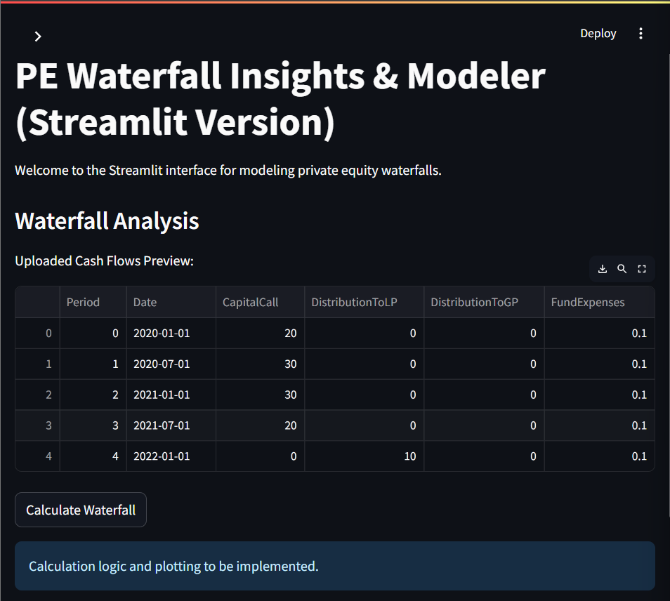
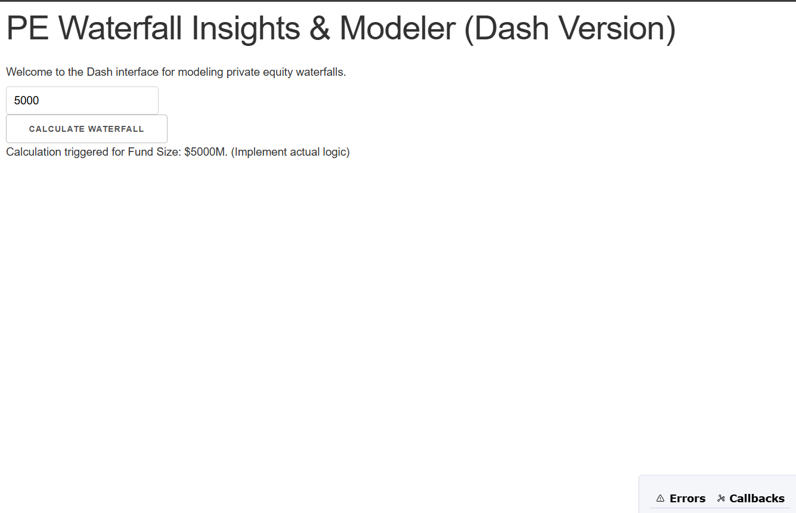

# PE Waterfall Insights & Modeler



**Project Goal:** To develop an analytical tool using Python, Dash, and Streamlit that allows users to model, analyze, and visualize private equity waterfall distributions under various scenarios. This tool aims to provide clarity and actionable insights into how fund performance and distribution structures impact returns for both Limited Partners (LPs) and General Partners (GPs).


---

## Table of Contents

- [Project Description](#project-description)
- [Key Features](#key-features)
- [Tech Stack](#tech-stack)
- [Visualization Examples](#visualization-examples)
  - [Waterfall Distribution Flow](#waterfall-distribution-flow)
  - [Sensitivity Analysis](#sensitivity-analysis)
  - [Scenario Comparison](#scenario-comparison)
- [Dashboard Mockup](#dashboard)
- [Getting Started](#getting-started)
  - [Prerequisites](#prerequisites)
  - [Installation & Running](#installation--running)
- [Contributing](#contributing)
- [License](#license)

---

## Project Description

The **PE Waterfall Insights & Modeler** is designed to demystify the complex mechanics of private equity fund distributions. It enables users to input fund-specific parameters and cash flow data (both aggregated for European models and deal-by-deal for American models) to simulate how profits are allocated. By offering scenario analysis and sensitivity tools, the project helps users understand the financial implications of different fund structures and performance outcomes.

---

## Key Features

*   **Flexible Waterfall Modeling:**
    *   Supports both **European (Whole Fund)** and **American (Deal-by-Deal)** waterfall structures.
    *   Customizable inputs for all critical parameters:
        *   Total Fund Size, LP & GP Capital Commitments
        *   Preferred Return (Hurdle Rate)
        *   GP Catch-Up Percentage
        *   Carried Interest Split
        *   Management Fees
*   **Cash Flow Management:**
    *   Allows input of fund-level or deal-level cash flows over time.
    *   Supports CSV upload for cash flow data.
*   **In-Depth Analytics:**
    *   **Scenario Analysis:** Create and compare outcomes based on varying inputs.
    *   **Sensitivity Analysis:** Understand the impact of changes in key variables (e.g., exit multiples, hurdle rates) on LP/GP returns.
    *   Calculation of key performance metrics: LP/GP Net IRR & MOIC, Total Carried Interest, Effective Profit Split.
*   **Interactive Visualizations:**
    *   Clear visual breakdown of distributions across waterfall tiers.
    *   Comparative charts for different scenarios.
    *   Time-series visualization of cumulative distributions.
*   **User-Friendly Interface:** Built with Dash and Streamlit for an intuitive and interactive experience.

---

## Tech Stack

*   **Core Language:** Python 3.x
*   **Data Analysis & Numerical Computation:**
    *   Pandas
    *   NumPy
*   **Web Application & Dashboarding:**
    *   **Dash by Plotly:** For creating sophisticated, interactive web-based dashboards and analytical applications.
    *   **Streamlit:** For rapidly building and deploying data-centric web applications with a focus on ease of use.
    *   
*   **Visualization Libraries:**
    *   Plotly Express & Plotly Graph Objects (used by Dash)
    *   Streamlit's native charting capabilities (which can also wrap Plotly, Matplotlib, etc.)
*   **Version Control:** Git & GitHub

---


### Waterfall Distribution Flow

This chart illustrates how capital flows through the different tiers of the waterfall (Return of Capital, Preferred Return, GP Catch-up, and Final Profit Split).


*Caption: Example of a stacked bar chart showing distribution amounts per tier.*

### Sensitivity Analysis

This type of visual helps understand how a change in a key input (e.g., overall fund return) affects LP and GP IRR.


*Caption: Example of a line graph showing LP IRR vs. GP IRR at different overall fund return rates.*

### Scenario Comparison

Compare key metrics like final LP profit share or GP carried interest across different user-defined scenarios.


*Caption: Example of a grouped bar chart comparing LP MOIC across three different fund scenarios.*

---

## Dashboard 

A preview of the main dashboard interface, showcasing input panels, key metric displays, and interactive charts.


*Caption: Mockup of the interactive dashboard showing input fields on the left and various charts/KPIs on the right.*

---

## Getting Started

Follow these instructions to get a copy of the project up and running on your local machine for development and testing purposes.

### Prerequisites

*   Python 3.8 or higher
*   pip (Python package installer)
*   Git

### Installation & Running

1.  **Clone the repository:**
    ```bash
    git clone https://github.com/pras529/PE_Waterfall_Insights.git
    ```

2.  **Create a virtual environment (recommended):**
    ```bash
    python -m venv venv
    # On Windows
    venv\Scripts\activate
    # On macOS/Linux
    source venv/bin/activate
    ```

3.  **Install dependencies:**
    ```bash
    pip install -r requirements.txt
    ```
    

4.  **Run the application:**

    *   **For Dash App:**
        ```bash
        python app.py
        ```
        Then open your browser to `http://127.0.0.1:8050/` (or the port specified in your Dash app).

    *   **For Streamlit App:**
        ```bash
        streamlit run app_streamlit.py
        ```
        Streamlit will typically open the app automatically in your browser or provide a local URL.

    

---

## Contributing

Contributions are welcome! If you'd like to contribute, please follow these steps:

1.  Fork the Project
2.  Create your Feature Branch (`git checkout -b feature/AmazingFeature`)
3.  Commit your Changes (`git commit -m 'Add some AmazingFeature'`)
4.  Push to the Branch (`git push origin feature/AmazingFeature`)
5.  Open a Pull Request

Please ensure your code adheres to standard Python style guides (e.g., PEP 8).

---

## License

This project is licensed under the MIT License - see the `LICENSE.md` file for details. (You'll need to add a LICENSE.md file, typically with the MIT license text).

---
